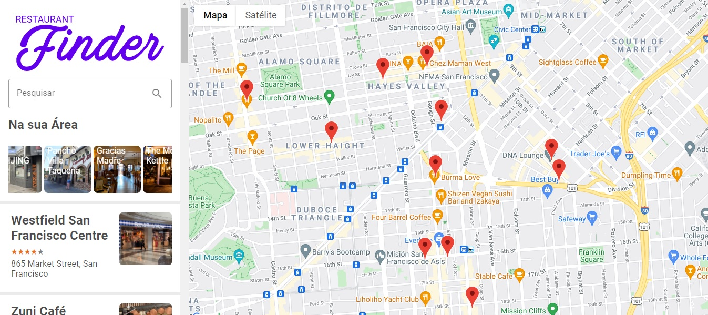

<h1 align="center">Restaurants-Search</h1>
<p align="center">
  Este projeto foi publicado no Netlify, no link <a href="https://get-food-diego.netlify.app/">https://get-food-diego.netlify.app/</a>
</p>

<p align="center">
  
</p>

<p align="center">
  <a href="#-sobre">Sobre</a>&nbsp;&nbsp;&nbsp;|&nbsp;&nbsp;&nbsp;
  <a href="#-projeto">Projeto</a>&nbsp;&nbsp;&nbsp;|&nbsp;&nbsp;&nbsp;
  <a href="#-tecnologias">Tecnologias</a>&nbsp;&nbsp;&nbsp;|&nbsp;&nbsp;&nbsp;
  <a href="#-como-executar">Como Executar</a>&nbsp;&nbsp;&nbsp;|&nbsp;&nbsp;&nbsp;
  <a href="#-licença">Licença</a>&nbsp;&nbsp;&nbsp;|&nbsp;&nbsp;&nbsp;
  <a href="#-autor">Autor</a>
</p>


## ✨ Sobre


Projeto desenvolvido na trilha de React web, no curso ministrado pelo Patrick Narciso na plataforma da Digital Innovation One


## ✨ Projeto

O projeto foi desenvolvido para fazer pesquisas de restaurantes, usando o google maps

> Obs.: Estes projetos tem autenticação via chave do google


## ✨ Tecnologias

- [React](https://reactjs.org/)
- [Styled-Components](https://styled-components.com/)
- [Redux](https://redux.js.org/)
  

## 🚀 Como executar

Como pré-requisitos, é necessário instalar o [Node.js](https://nodejs.org/pt-br/) e o [Yarn](https://classic.yarnpkg.com/en/docs/install/) em suas versões LTS.

Após a instalação do Node e Yarn, basta clonar o projeto e acesse a pasta do mesmo.

```bash
$ git clone https://github.com/diegohfcelestino/restaurants-search.git
$ cd restaurants-search
```

Para iniciá-lo, siga os passos abaixo:

```bash
# Instalar as dependências
$ yarn

# Iniciar o projeto
$ yarn start
```

O app estará disponível no seu browser pelo endereço [http://localhost:3000](http://localhost:3000).


## 📄 Licença

Esse projeto está sob a licença MIT.

---

## ✨ Autor

Feito por **Diego Henrique Ferreira**.
Entre em contato!

[](https://github.com/diegohfcelestino)
[](https://www.linkedin.com/in/diego-ferreira-34b6348b/)
[](https://api.whatsapp.com/send?phone=+5516991187434&text=Hello!)
[](mailto:diegohfcelestino@gmail.com)
